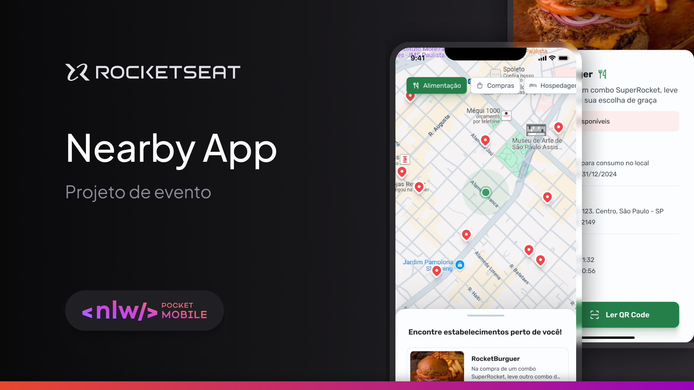

# Nearby

Projeto desenvolvido durante o NLW Pocket Mobile da [Rocketseat](https://app.rocketseat.com.br/) que consiste em um aplicativo mobile de clube de benefícios com cupons para utilizar em estabelicimentos próximos a você.



## Índice

- [Ferramentas](#ferramentas)
- [Instalação](#instalação)
- [Funcionalidade](#funcionalidades)
- [Layout](#layout)
- [Licença](#licença)

## Ferramentas

- **React**: 18.3.1
- **React Native**: 0.76.3
- **Expo**: ~52.0.17
- **Axios**: ^1.7.9
- **Typescript**: ~5.3.3

## Instalação

Siga as etapas abaixo para configurar e instalar o Nearby em seu ambiente local:

1. Clone o repositório e acesse o diretório:

```bash
git clone git@github.com:brunohnsouza/nlw-pocket-mobile-react-native.git
cd nlw-pocket-mobile-react-native
```

2. Instale as dependências do projeto:

```bash
npm install
```

3. Inicie o servidor em modo de desenvolvimento:

```bash
npx expo start
```

Após iniciar o projeto, use o app `Expo Go` para escanear o QR Code presente no terminal ou pressione a tecla `w` para abrir seu projeto na web.

> OBS.: Siga os passos de instalação do back-end desse aplicativo [aqui](https://github.com/brunohnsouza/nlw-pocket-mobile-node).

## Funcionalidades

O projeto oferece as seguintes funcionalidades:

- Seleção dos estabelecimentos por categoria (alimentação, compras, hospedagem, cinema, padaria)
- Scanner QRCode para selecionar os cupons disponíveis no estabelecimento;

## Layout

[Figma](https://www.figma.com/community/file/1448070647757721748)

## Licença

[MIT](https://choosealicense.com/licenses/mit/)
